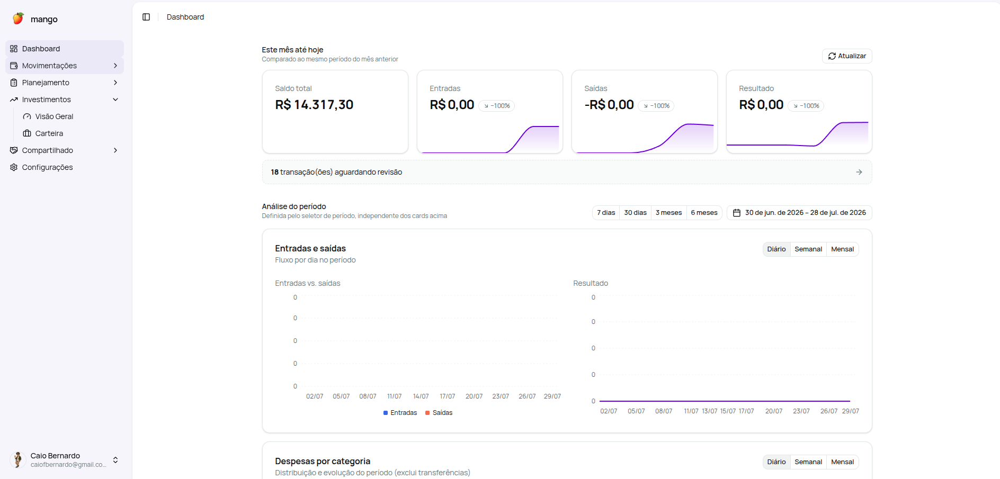
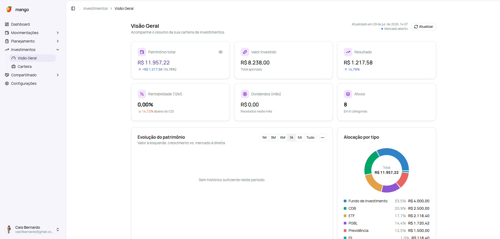

<p align="center">
  
</p>

<h1 align="center">mango</h1>

<p align="center">
  <strong>Suas finanças pessoais no piloto automático — sem planilha.</strong><br>
  Importa tudo sozinho pelo Open Finance e reúne cartões, orçamentos, objetivos e investimentos numa
  visão só — para você fechar o mês em minutos, não em horas.
</p>

<p align="center">
  
  <a href="LICENSE"></a>
  
  
  
  
  
  
</p>

---

O **mango** troca a planilha de finanças por um sistema que **importa os dados sozinho** pelo Open
Finance (via [Pluggy](https://pluggy.ai)). Ele trata corretamente **competência × caixa** — a fatura do
cartão não é contada duas vezes —, separa **transferências** das entradas e saídas reais e junta
**orçamentos, objetivos e investimentos** num lugar só. A proposta não é digitar lançamento a
lançamento: é **revisar e confiar** nos números. Feito para **pessoa física no Brasil**, tudo em **R$**
(fuso `America/São_Paulo`) e, por ser **self-hosted**, seus dados ficam no **seu** servidor.

## Screenshots

<!-- Troque os arquivos em docs/screenshots/ pelas suas prints -->
<p align="center">
  
  
</p>

## Recursos

- **Importação automática (Open Finance)** — contas, cartões e investimentos sincronizados via Pluggy.
- **Transações inteligentes** — categorização, detecção automática de transferências entre suas contas
  e marcação de "revisada".
- **Faturas de cartão** — modelo explícito de competência × caixa, para o gasto no cartão não bagunçar
  o fluxo de caixa.
- **Orçamentos** — limites mensais por categoria, com acompanhamento de consumo.
- **Objetivos** — metas com contas e investimentos vinculados e progresso.
- **Assinaturas** — detecção automática de recorrências + cadastro manual, com total mensal.
- **Investimentos** — renda fixa, ações e **FIIs** (proventos e dividend yield), comparação com
  **IBOV, CDI, SELIC e IPCA**, e fundamentos de FII a partir dos dados abertos da **CVM**.
- **Design próprio** — tema claro/escuro, cor de destaque à sua escolha e o mascote mango; interface
  sóbria, sem gamificação.
- **Segurança** — senha (bcrypt), **2FA (TOTP)**, sessões no servidor, CSRF e credenciais do Pluggy
  **cifradas em repouso**.

## Início rápido (self-hosted)

> **Pré-requisitos:** [Docker](https://docs.docker.com/get-docker/) (com Docker Compose) e uma conta no
> [Pluggy](https://pluggy.ai). O mango nasce conectado ao Open Finance, então você precisa das suas
> credenciais (`clientId`, `clientSecret` e um `itemId` já conectado) para concluir o cadastro inicial.

```bash
# 1. Clone
git clone https://github.com/CaioFerreiraB/mango.git
cd mango

# 2. Configure o ambiente
cp deploy/.env.example deploy/.env
make gen-keys          # gera ENCRYPTION_KEY e SECRET_KEY — cole as duas linhas em deploy/.env

# 3. Suba a stack (app + PostgreSQL)
make docker-up         # docker compose -f docker-compose.selfhosted.yml up --build
```

Abra **http://localhost:8000** — o primeiro acesso cai no assistente **/setup**, que cria o usuário
dono, ativa o **2FA** e conecta o Pluggy. Migrations e a carga inicial de categorias rodam sozinhas no
boot. Para derrubar mantendo os dados: `make docker-down`.

## Como funciona

Uma única imagem Docker serve a **API (FastAPI)** e a **SPA (React)** no mesmo processo; os dados ficam
num **PostgreSQL** no seu ambiente. A sincronização puxa do Pluggy sob demanda e um agendador cuida das
tarefas periódicas (materialização de orçamento, snapshot de saldo, fundamentos de FII).

**Stack:** Python 3.12 · FastAPI · SQLAlchemy 2 · Alembic · PostgreSQL 16 · React · TypeScript · Vite ·
shadcn/ui · Tailwind.

## Roadmap

- Fontes de renda
- Divisão de contas (estilo Splitwise)
- Notificações via Telegram
- App desktop empacotado (modo local, monousuário, via pywebview)

## Desenvolvimento

Rodar sem Docker, arquitetura e specs em [`docs/dev/`](docs/dev/) (`SETUP.md`, `DESENVOLVIMENTO.md`,
`requisitos.md`). Atalhos no [`Makefile`](Makefile): `make setup`, `make run`, `make test`, `make lint`.

## Licença

[MIT](LICENSE) © 2026 Caio Ferreira Bernardo
