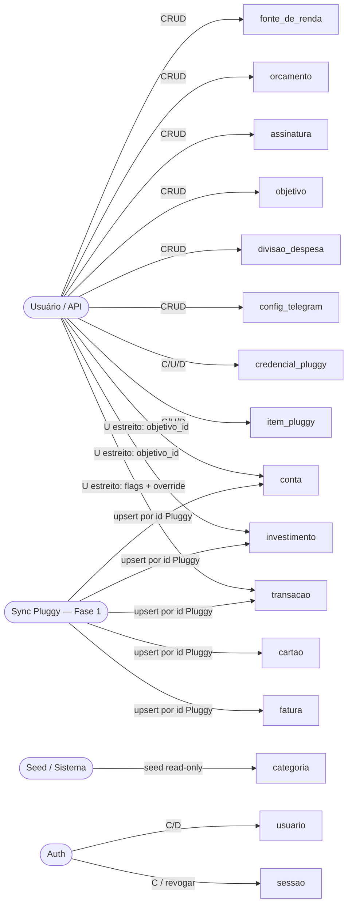

# Uso do CRUD — mango (Fase 0)

> Companheiro de `docs/dev/modelo-de-dados.md`. Classifica cada entidade por **fonte/propriedade**
> e define **quem** cria/lê/atualiza/apaga — insumo direto para desenhar os endpoints e os
> repositórios da Fase 0. Reflete `requisitos.md` §4–§5 e a descoberta do Pluggy.

> **Prefixo de rota:** todos os endpoints de domínio são servidos sob **`/api`** (ex.: `/api/contas`,
> `/api/transacoes`) para a SPA ser dona da raiz na mesma origem; `/health`, `/docs` e `/openapi.json`
> seguem na raiz. As tabelas abaixo listam os caminhos **sem** o prefixo, por concisão.

## 1. Atores

| Ator | Quem é | Quando escreve |
| --- | --- | --- |
| **Usuário** | requisições autenticadas (self-hosted) ou usuário implícito (local) | via API |
| **Sync Pluggy** | rotina de importação (Fase 1; sob demanda / 1×dia, §4.3) | upsert por id do Pluggy |
| **Seed/Sistema** | bootstrap/migration e jobs internos | seed da taxonomia |
| **Auth** | fluxo de cadastro/login/sessão (§5.2) | cadastro, login, logout/revogação |

## 2. Classes de propriedade

- **Pluggy (sync escreve, usuário lê):** `instituicao`, `conta`, `conta_bancaria`,
  `conta_saldo_reservado`, `cartao`, `fatura`, `fatura_encargo`, `fatura_pagamento`, `transacao`,
  `transacao_pagamento`, `investimento`, `investimento_transacao`.
  → o usuário **lê** e só escreve **campos estreitos** (ver §4).
- **Usuário (CRUD completo):** `fonte_de_renda`, `orcamento`, `orcamento_mensal`, `assinatura`,
  `objetivo`, `divisao_despesa`, `config_telegram`, `credencial_pluggy`, `item_pluggy`.
- **Referência/seed (read-only):** `categoria` (espelho de `GET /categories`).
- **Auth/sistema:** `usuario`, `sessao`.

## 3. Matriz CRUD

`C/R/U/D` = quem realiza a operação. **—** = não exposta. "estreito" = só os campos listados em §4.

| Entidade | Fonte | C | R | U | D |
| --- | --- | --- | --- | --- | --- |
| usuario | auth | cadastro / implícito | self | self | self (LGPD) |
| sessao | auth | login | sistema | — | logout / revogar |
| fonte_de_renda | usuário | usuário | usuário | usuário | usuário |
| credencial_pluggy | usuário | usuário | sistema¹ | usuário | usuário |
| item_pluggy | usuário | usuário (widget) | usuário | sync (status) | usuário (desconectar) |
| instituicao | Pluggy | sync | usuário | sync | sync |
| conta | Pluggy | sync | usuário | sync | sync (cascade) |
| conta_bancaria | Pluggy | sync | usuário | sync | sync (cascade) |
| conta_saldo_reservado | Pluggy | sync | usuário | sync | sync (cascade) |
| cartao | Pluggy | sync | usuário | sync | sync (cascade) |
| fatura | Pluggy | sync | usuário | sync | sync (cascade) |
| fatura_encargo | Pluggy | sync | usuário | sync | sync (cascade) |
| fatura_pagamento | Pluggy | sync | usuário | sync | sync (cascade) |
| categoria | seed | seed | todos | — | — |
| transacao | Pluggy | sync | usuário | sync + **usuário estreito** | sync (cascade) |
| transacao_pagamento | Pluggy | sync | usuário | sync | sync (cascade) |
| orcamento | usuário | usuário | usuário | usuário | usuário |
| orcamento_mensal | usuário | sistema² + usuário | usuário | usuário | usuário |
| assinatura | usuário | usuário / sync (auto) | usuário | usuário | usuário |
| objetivo | usuário | usuário | usuário | usuário | usuário |
| investimento | Pluggy | sync | usuário | sync + **usuário estreito** | sync (cascade) |
| investimento_transacao | Pluggy | sync | usuário | sync | sync (cascade) |
| divisao_despesa | usuário | usuário | usuário | usuário | usuário |
| config_telegram | usuário | usuário | usuário | usuário | usuário |

¹ `credencial_pluggy` nunca é lida de volta em claro pela API (campos cifrados, §5.5); o sistema só
a decifra em runtime para autenticar no Pluggy.
² `orcamento_mensal` é **materializado** a partir de `orcamento` (sistema) e depois **editável**
pelo usuário para alterar só aquele mês.

## 4. Campos graváveis pelo usuário em entidades do Pluggy

O sync é dono dos dados importados; o usuário só pode escrever estes campos (não destrói o que o
re-sync traz):

| Entidade | Campos do usuário | Regra |
| --- | --- | --- |
| `transacao` | `eh_transferencia`, `revisada`, `categoria_override_id`, `categoria_ajustada_usuario` | re-sync **não** sobrescreve o override (§4.5); pareamento auto seta `contraparte_id`/`eh_transferencia` |
| `conta` | `objetivo_id` | vínculo 1:1-max (#4) |
| `investimento` | `objetivo_id` | vínculo 1:1-max (#4) |

## 5. Diagrama de uso

## 6. Implicação para a Fase 0

O **sync** do Pluggy é Fase 1, mas a Fase 0 já entrega:

- **Repositórios + CRUD** de todas as entidades, com **isolamento por `usuario_id`** e testes
  (SQLite **e** Postgres no CI). Os testes criam `conta`/`transacao`/etc. direto pelos
  repositórios — não dependem do Pluggy.
- **Métodos de upsert** (por id do Pluggy) das entidades-Pluggy, prontos para o sync consumir
  depois, mais os **endpoints de leitura** e os **campos graváveis pelo usuário** (§4).
- Endpoints de **CRUD completo** para as entidades de usuário.
- `categoria` populada por **seed** a partir de `GET /categories`.

> Notificações Telegram (Fase 4) e indicadores de mercado (Fase 3) têm a entidade modelada
> (`config_telegram`) ou ficam fora deste escopo (indicadores = fonte externa, não Pluggy); a
> lógica/CRUD desses fluxos entra nas fases respectivas.
