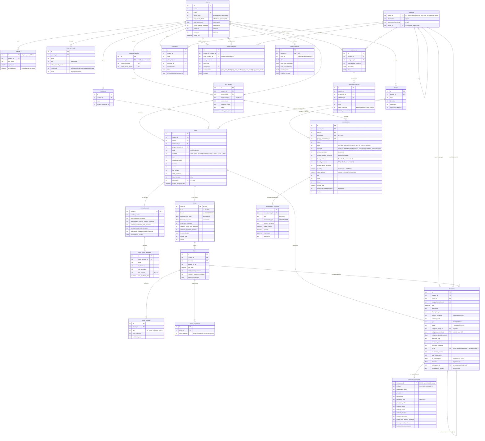

# Modelo de dados — mango (Fase 0)

> **Status:** design da Fase 0 (decisão #16: banco completo + CRUD testado **antes da UI**).
> Insumo direto para os models SQLAlchemy + 1ª migration Alembic. Os campos das entidades vindas
> do Pluggy são fiéis às **capturas ao vivo** em `scripts/discovery/raw/*.json` (descoberta de
> 2026-06-26, ver `docs/dev/descoberta-pluggy.md`). Companheiro: `docs/dev/crud.md` (uso do CRUD).

Cobre todas as entidades de domínio de `requisitos.md` §4.1–4.12 e §5.2/§5.5. Convenções:

- **`usuario_id` em toda entidade de domínio** (§5.2, isolamento por repositório). Única exceção:
  `categoria` é referência global read-only (taxonomia do Pluggy).
- **Dinheiro = INTEGER em centavos (#2)**; exceção pontual em cotação/quantidade de investimento
  (NUMERIC — ver §"Notas").
- **Enums = string + CHECK/validação Pydantic** (portável SQLite+Postgres; sem ENUM nativo).
- **Timestamps da aplicação** (`criado_em`/`atualizado_em`) separados dos do Pluggy
  (`pluggy_criado_em`/`pluggy_atualizado_em`, usados no delta de sync).

---

## 1. Diagrama relacional

---

## 2. Dicionário de campos

Legenda: **C** = INTEGER centavos · **N?** = nullable · origem = campo bruto do Pluggy (`raw/*.json`)
ou *(app)* quando é dado nosso. Só os campos não óbvios trazem nota.

### 2.1 Identidade e autenticação (§5.2)

**`usuario`** *(app)* — perfil + auth. No modo local há um usuário implícito fixo.

| Coluna | Tipo | N? | Origem | Obs |
| --- | --- | --- | --- | --- |
| id | int PK | — | (app) | |
| nome | str | — | (app) | obrigatório (§4.1) |
| email | str UK | — | (app) | obrigatório (§4.1) |
| senha_hash | str | sim | (app) | bcrypt/argon2; null no modo local |
| totp_secret_cifrado | str | sim | (app) | cifrado em repouso (§5.5); 2FA/recuperação #15 |
| data_nascimento | date | sim | (app) | opcional #6 |
| salario_mensal_centavos | int C | sim | (app) | opcional #6 |
| formacao / ocupacao | str | sim | (app) | opcional #6 |
| criado_em / atualizado_em | datetime | — | (app) | |

**`sessao`** *(app)* — sessão no servidor (#13), ID opaco, revogável (logout / sair de todos).

| Coluna | Tipo | N? | Obs |
| --- | --- | --- | --- |
| id | str PK | — | ID opaco aleatório (não-JWT) |
| usuario_id | int FK | — | |
| csrf_token | str | — | proteção CSRF (§5.2) |
| criado_em / expira_em | datetime | — | |
| revogada_em | datetime | sim | preenchida ao revogar |
| user_agent / ip | str | sim | auditoria opcional |

### 2.2 Renda (§4.1, #17)

**`fonte_de_renda`** *(app)* — fixa ou variável; base p/ previsto×realizado futuro.

| Coluna | Tipo | N? | Obs |
| --- | --- | --- | --- |
| nome | str | — | |
| tipo | str | — | `fixa` \| `variavel` |
| valor_estimado_centavos | int C | — | |
| recorrencia | str | — | `mensal\|trimestral\|semestral\|anual\|irregular` |
| fonte | str | sim | empregador/cliente |

### 2.3 Credenciais e conexões Pluggy (§4.3, §5.5)

`apiKey`/`connectToken` são **efêmeros** (derivados em runtime) — **não** persistidos.

**`credencial_pluggy`** — o app do Pluggy do usuário (um por usuário, nível gratuito).

| Coluna | Tipo | N? | Origem | Obs |
| --- | --- | --- | --- | --- |
| usuario_id | int FK UK | — | (app) | 1 app por usuário |
| client_id_cifrado | str | — | (app) | **cifrado** §5.5 |
| client_secret_cifrado | str | — | (app) | **cifrado** §5.5 |

**`item_pluggy`** — uma conexão (Meu Pluggy). Várias contas penduram num item.

| Coluna | Tipo | N? | Origem | Obs |
| --- | --- | --- | --- | --- |
| credencial_id | int FK | — | (app) | |
| pluggy_item_id | str | — | `itemId` | sensível → **cifrado** §5.5 |
| connector_id / connector_nome | int/str | sim | item/connector | instituição da conexão |
| status / status_detalhe | str | sim | item.status | UPDATED/OUTDATED/LOGIN_ERROR/… |
| ultimo_sync_em | datetime | sim | (app) | controla o delta (§4.3: 1×/dia ou sob demanda) |

### 2.4 Instituições, contas, cartões, faturas (§4.2)

**`instituicao`** *(app/derivado)* — nome + `pluggy_connector_id`. Conta referencia instituição.

**`conta`** — `raw/accounts.json` (campos comuns BANK e CREDIT).

| Coluna | Tipo | N? | Origem (accounts.json) | Obs |
| --- | --- | --- | --- | --- |
| pluggy_account_id | str UK | — | `id` | idempotência do upsert |
| item_id / instituicao_id | int FK | — | `itemId` / (derivado) | |
| type | str | — | `type` | `BANK` \| `CREDIT` |
| subtype | str | — | `subtype` | `CHECKING_ACCOUNT\|SAVINGS_ACCOUNT\|CREDIT_CARD` |
| nome / marketing_name | str | sim | `name` / `marketingName` | |
| numero | str | sim | `number` | |
| owner / tax_number | str | sim | `owner` / `taxNumber` | null no cartão da captura |
| saldo_centavos | int C | — | `balance` | cartão vem negativo (ex. -335.4) |
| currency_code | str | — | `currencyCode` | BRL |
| objetivo_id | int FK | sim | (app) | vínculo 1:1-max #4 |
| pluggy_criado_em / pluggy_atualizado_em | datetime | sim | `createdAt`/`updatedAt` | |

**`conta_bancaria`** (1:1 com `conta` BANK) — `accounts.json.bankData`.

| Coluna | Origem (bankData) | N? |
| --- | --- | --- |
| transfer_number | `transferNumber` | sim |
| closing_balance_centavos | `closingBalance` | sim |
| automatically_invested_balance_centavos | `automaticallyInvestedBalance` | sim |
| overdraft_contracted_limit_centavos | `overdraftContractedLimit` | sim |
| overdraft_used_limit_centavos | `overdraftUsedLimit` | sim |
| unarranged_overdraft_amount_centavos | `unarrangedOverdraftAmount` | sim |
| has_reserved_balance | `hasReservedBalance` | — |

**`conta_saldo_reservado`** (N por conta_bancaria) — `bankData.reservedBalances[]` achatado com o
`availableAmounts[0]` + `remuneration{}`. **Opcional/baixa prioridade** ("caixinhas" não estão nos
requisitos); incluído por completude da normalização.

| Coluna | Origem | Obs |
| --- | --- | --- |
| nome / identificacao | `name` / `identification` | |
| valor_centavos | `availableAmounts[].amount` | |
| rem_indexer / rem_rate_type / rem_pre_fixed_rate / rem_periodicity | `…remuneration.*` | `preFixedRate` é NUMERIC (taxa) |

**`cartao`** (1:1 com `conta` CREDIT) — `accounts.json.creditData`.

| Coluna | Origem (creditData) | N? | Obs |
| --- | --- | --- | --- |
| level / brand / brand_additional_info | `level`/`brand`/`brandAdditionalInfo` | sim | |
| balance_close_date | `balanceCloseDate` | sim | **fechamento** (§4.2) |
| balance_due_date | `balanceDueDate` | sim | **vencimento** (§4.2) |
| credit_limit_centavos | `creditLimit` | sim | |
| available_credit_limit_centavos | `availableCreditLimit` | sim | |
| balance_foreign_currency_centavos | `balanceForeignCurrency` | sim | |
| minimum_payment_centavos | `minimumPayment` | sim | |
| is_limit_flexible | `isLimitFlexible` | sim | |
| holder_type / status | `holderType` / `status` | sim | |

> `creditData.additionalCards` e `disaggregatedCreditLimits` vieram **null** na captura. Quando
> aparecerem (listas), viram tabelas-filhas `cartao_adicional` / `cartao_limite_desagregado`
> (shape a confirmar) — **adiado** até haver dado real.

**`fatura`** — `raw/bills_*.json` (`GET /bills?accountId`).

| Coluna | Origem (bills) | N? | Obs |
| --- | --- | --- | --- |
| cartao_id | (via accountId) | — | |
| pluggy_bill_id | `id` | — | |
| due_date | `dueDate` | — | |
| total_amount_centavos | `totalAmount` | — | |
| total_amount_currency_code | `totalAmountCurrencyCode` | — | BRL |
| minimum_payment_centavos | `minimumPaymentAmount` | sim | |
| allows_installments | `allowsInstallments` | sim | |

**`fatura_encargo`** (N por fatura) — `bills.financeCharges[]`.

| Coluna | Origem | Obs |
| --- | --- | --- |
| tipo | `type` | `IOF`, `LATE_PAYMENT_FEE`, … |
| valor_centavos | `amount` | |
| currency_code / additional_info | `currencyCode` / `additionalInfo` | |

**`fatura_pagamento`** (N por fatura) — `bills.payments[]` veio **vazio** na captura. Tabela
criada com `valor_centavos`/`data`; **shape a confirmar** quando houver pagamento real.

### 2.5 Categorias (§4.5) — referência global

**`categoria`** — espelho de `GET /categories` (`raw/categories.json`). **Sem `usuario_id`**
(read-only, compartilhada). 130 linhas, 22 raízes, hierarquia ≤3 níveis. Seed por migration/job.

| Coluna | Origem (categories) | Obs |
| --- | --- | --- |
| pluggy_id | `id` | PK; a maioria tem 8 dígitos, o 3º nível chega a 9 (ex. `200300000`) → **VARCHAR(16)** (Postgres impõe o tamanho; SQLite não) |
| description | `description` | inglês |
| description_translated | `descriptionTranslated` | pt-BR (exibição) |
| parent_id | `parentId` | auto-FK; null nas 22 raízes |

> A taxonomia é **somente leitura** (`POST /categories` → 405, `raw/probe_post_categories.json`).
> Sem taxonomia própria nem mapeamento — adoção direta + override por transação (§4.5).

### 2.6 Transações (§4.3–4.5)

**`transacao`** — `raw/transactions.json` (`GET /v2/transactions`, cursor; v1 deprecado 410).

| Coluna | Tipo | N? | Origem (transactions) | Obs |
| --- | --- | --- | --- | --- |
| pluggy_transaction_id | str UK | — | `id` | idempotência |
| conta_id | int FK | — | `accountId` | |
| date | datetime | — | `date` | ISO8601 |
| description / description_raw | str | sim | `description` / `descriptionRaw` | |
| amount_centavos | int C | — | `amount` | **`round(amount*100)`** (vem em reais decimais) |
| amount_in_account_currency_centavos | int C | sim | `amountInAccountCurrency` | |
| currency_code | str | — | `currencyCode` | |
| type | str | — | `type` | `DEBIT` \| `CREDIT` |
| status | str | — | `status` | `POSTED` \| `PENDING` |
| balance_centavos | int C | sim | `balance` | |
| categoria_pluggy_id | str FK | sim | `categoryId` | sugerida (→ `categoria`) |
| categoria_override_id | str FK | sim | (app) | override local (§4.5) |
| categoria_ajustada_usuario | bool | — | (app) | re-sync **não** sobrescreve |
| merchant_cnpj / merchant_cnae / merchant_nome / merchant_categoria | str | sim | `merchant.{cnpj,cnae,businessName,category}` | |
| operation_type / operation_type_additional_info | str | sim | `operationType*` | |
| provider_code / provider_id / ordem | str/int | sim | `providerCode`/`providerId`/`order` | |
| bill_id | int FK | sim | `creditCardMetadata.billId` | **competência** (§4.2) → `fatura` |
| installment_number / total_installments | int | sim | `creditCardMetadata.installmentNumber/totalInstallments` | parcelas |
| total_amount_centavos | int C | sim | `creditCardMetadata.totalAmount` | total parcelado |
| payee_mcc | int | sim | `creditCardMetadata.payeeMCC` | código MCC |
| **eh_transferencia** | bool | — | (app) | flag nosso (§4.3/§4.4) |
| **revisada** | bool | — | (app) | flag nosso (§4.3) |
| contraparte_id | int FK | sim | (app) | perna pareada (§4.4, self-FK) |
| transferencia_origem | str | sim | (app) | `auto` \| `manual` |
| pluggy_criado_em / pluggy_atualizado_em | datetime | sim | `createdAt`/`updatedAt` | |

**`transacao_pagamento`** (1:1, só em transferências/pagamentos) — `transactions.paymentData`.

| Coluna | Origem (paymentData) | Obs |
| --- | --- | --- |
| metodo | `paymentMethod` | `PIX\|TED\|DOC\|BOLETO` |
| reason / reference_number / receiver_reference_id | `reason`/`referenceNumber`/`receiverReferenceId` | |
| payer_nome / payer_conta / payer_agencia | `payer.{name,accountNumber,branchNumber}` | |
| payer_doc_tipo / payer_doc_valor | `payer.documentNumber.{type,value}` | CPF/CNPJ — pareamento §4.4 |
| payer_routing / payer_routing_ispb | `payer.{routingNumber,routingNumberISPB}` | |
| receiver_* | `receiver.*` (idem payer) | |
| boleto_barcode / boleto_digitable_line | `boletoMetadata.{barcode,digitableLine}` | |
| boleto_base_amount_centavos / boleto_interest_centavos / boleto_discount_centavos / boleto_penalty_centavos | `boletoMetadata.{baseAmount,interestAmount,discountAmount,penaltyAmount}` | C |

### 2.7 Orçamentos (§4.6, #20)

**`orcamento`** *(app)* — definição/status (o que o usuário cadastrou; pode ser recorrente).

| Coluna | Tipo | Obs |
| --- | --- | --- |
| categoria_id | str FK | categoria **ou** subcategoria |
| limite_padrao_centavos | int C | |
| recorrente | bool | se replica para todo mês |
| ativo | bool | |

UNIQUE(`usuario_id`, `categoria_id`).

**`orcamento_mensal`** *(app)* — histórico por mês/ano, **editável** (altera só aquele mês);
materializado de `orcamento` (default = `limite_padrao`). Base dos alertas 50/75/90/100%.

| Coluna | Tipo | Obs |
| --- | --- | --- |
| orcamento_id | int FK | |
| categoria_id | str FK | |
| ano / mes | int | |
| limite_centavos | int C | editável |
| editado_manualmente | bool | distingue override do valor herdado |

UNIQUE(`usuario_id`, `categoria_id`, `ano`, `mes`). Validação #20 (soma subcat ≤ cat) no backend.

### 2.8 Assinaturas (§4.7)

**`assinatura`** *(app)* — manual ou autodetectada do Pluggy (`detectada_automaticamente`).

| Coluna | Tipo | Obs |
| --- | --- | --- |
| nome / descricao | str | |
| valor_centavos | int C | |
| categoria_id | str FK | seguindo a taxonomia das transações |
| periodicidade | str | `mensal\|...` |
| data_inicio | date? | |
| ativa | bool | vigente |
| detectada_automaticamente | bool | |
| conta_id | int FK? | origem, quando autodetectada |

### 2.9 Objetivos (§4.8, #4)

**`objetivo`** *(app)* — título, descrição, justificativa, valor-alvo. O **valor guardado** é a
soma dos saldos de `conta`/`investimento` vinculados (`objetivo_id`), calculado em runtime.

| Coluna | Tipo |
| --- | --- |
| titulo / descricao / justificativa | str |
| valor_alvo_centavos | int C |

> Regra 1:1-max (#4) garantida pelo FK `objetivo_id` único em `conta` e `investimento`.

### 2.10 Investimentos (§4.9, #5)

**`investimento`** — `raw/investments.json` (`GET /investments?itemId`). Campos **variam por tipo**
→ a maioria nullable. Pluggy entrega valores **já calculados** (não recalculamos #5).

| Coluna | Tipo | N? | Origem (investments) | Obs |
| --- | --- | --- | --- | --- |
| pluggy_investment_id | str UK | — | `id` | |
| item_id / objetivo_id | int FK | sim | `itemId` / (app) | objetivo 1:1-max #4 |
| nome / numero | str | sim | `name` / `number` | |
| type | str | — | `type` | SECURITY/MUTUAL_FUND/FIXED_INCOME/ETF/EQUITY |
| subtype | str | sim | `subtype` | PGBL/RETIREMENT/INVESTMENT_FUND/CDB/ETF/REAL_ESTATE_FUND |
| saldo_centavos | int C | — | `balance` | |
| amount_centavos | int C | sim | `amount` | bruto atual |
| amount_original_centavos | int C | sim | `amountOriginal` | investido |
| taxes_centavos / taxes2_centavos | int C | sim | `taxes` / `taxes2` | **IR / IOF** (consumido #5) |
| amount_profit_centavos / amount_withdrawal_centavos | int C | sim | `amountProfit` / `amountWithdrawal` | |
| quantity | numeric | sim | `quantity` | **fracionária** → NUMERIC |
| value_unitario | numeric | sim | `value` | **cotação** → NUMERIC (precisão) |
| code / isin | str | sim | `code` / `isin` | ticker / ISIN |
| issuer / issuer_cnpj | str | sim | `issuer` / `issuerCNPJ` | |
| due_date / issue_date / purchase_date / grace_period_date | datetime | sim | idem | renda fixa |
| rate / rate_type / rate_periodicity | numeric/str | sim | `rate`/`rateType`/`ratePeriodicity` | indexador (ex. CDI 150%) |
| fixed_annual_rate / annual_rate / last_month_rate / last_twelve_months_rate | numeric | sim | idem | rentabilidade (% → NUMERIC) |
| indexer_additional_info / tax_exempt / price_factor / debtor / coupon_payment | misto | sim | idem | metadados |
| owner / status | str | sim | `owner` / `status` | ACTIVE/TOTAL_WITHDRAWAL/… |
| instituicao_emissora_nome / instituicao_emissora_numero | str | sim | `institution.{name,number}` | normalizado |
| pluggy_criado_em / pluggy_atualizado_em | datetime | sim | `createdAt`/`updatedAt` | |

**`investimento_transacao`** (N por investimento) — `GET /investments/{id}/transactions`
(`raw/investment_transactions_*.json`). Proventos/movimentos → DY de FII (§4.9).

| Coluna | Tipo | Origem | Obs |
| --- | --- | --- | --- |
| pluggy_id | str | `id` | |
| type | str | `type` | `BUY` \| `SELL` |
| movement_type | str | `movementType` | `CREDIT` \| `DEBIT` |
| amount_centavos | int C | `amount` | |
| value_unitario | numeric | `value` | cotação |
| quantity | numeric | `quantity` | |
| net_amount_centavos / expenses_centavos | int C | `netAmount` / `expenses` | nullable |
| trade_date / date | datetime | `tradeDate` / `date` | |
| indexer_percentage / price_factor / agreed_rate | numeric | idem | nullable |
| brokerage_number / description | str | idem | |

> **Indicadores de mercado** (IBOV/IPCA/CDI, §4.9/§5.6) **não** vêm do Pluggy → fonte externa, na
> Fase 3. Fora deste ER.

### 2.11 Divisão de contas (§4.11, #7)

**`divisao_despesa`** *(app)* — réplica reduzida do Splitwise; pareada (eu + outro), mesma instância.

| Coluna | Tipo | Obs |
| --- | --- | --- |
| criado_por_usuario_id | int FK | |
| outro_usuario_id | int FK | usuário da mesma instância |
| valor_centavos | int C | |
| descricao | str | |
| categoria_id | str FK | |
| modo_divisao | str | `pago_mim_dividir\|pago_mim_recebo\|pago_outro_dividir\|pago_outro_recebo` |
| quitada | bool | saldo entre os dois calculado em runtime |

### 2.12 Telegram (§4.12) — config

**`config_telegram`** *(app)* — modelado agora; notificações em si são Fase 4. `chat_id` capturado
**após o `/start`** do usuário.

| Coluna | Tipo | Obs |
| --- | --- | --- |
| usuario_id | int FK UK | |
| chat_id | str? | preenchido após `/start` |
| ativo | bool | |
| notif_nova_transacao | bool | agregada por sync |
| notif_nao_revisadas + horario_1 / horario_2 | bool + time | 2×/dia |
| resumo_diario | bool | |
| resumo_semanal + dia_semana | bool + int | |

---

## 3. Notas de modelagem

- **Centavos vs. NUMERIC.** Decisão #2 (INTEGER centavos) vale para **valores monetários
  agregados**. Exceção pontual: **cotação/quantidade** de investimento (`value`, `quantity`,
  `priceFactor`, taxas %) — o Pluggy entrega frações de muitas casas (ex. `value 3.605103`),
  que centavos truncaria. Esses campos usam **NUMERIC**. Totais de posição (`amount`,
  `amountOriginal`, `taxes`, …) seguem em centavos.
- **Ingestão de `amount`.** `transactions.amount` vem em **reais decimais** (ex. `-167.7`,
  `8500`) → `round(amount*100)` para centavos inteiros.
- **Competência × caixa (#8, §4.2).** Despesa de cartão → `transacao.bill_id`
  (`creditCardMetadata.billId`) → `fatura`. O **pagamento da fatura** aparece na conta corrente
  como categoria `05100000` ("Pagamento de cartão de crédito") + `eh_transferencia` → o gasto não
  conta duas vezes.
- **Pareamento de transferência (#9, §4.4).** `transacao.contraparte_id` (self-FK) liga as duas
  pernas; só quando **ambas as contas do usuário** estão conectadas. Heurística: `amount` oposto +
  `date` próxima + `transacao_pagamento` (doc/conta payer↔receiver) + categoria `04xxxxxx` (mesma
  titularidade). Sem contraparte conectada = perna única (`transferencia_origem='manual'` se o
  usuário marcar o flag à mão).
- **Categorização e re-sync (§4.5).** `categoria_pluggy_id` é a sugestão; `categoria_override_id`
  + `categoria_ajustada_usuario` é o override **local** (nossa fonte de verdade). O re-sync
  **nunca** sobrescreve um override.
- **Objetivo 1:1-max (#4).** O vínculo mora no FK `objetivo_id` de `conta`/`investimento` (coluna
  única ⇒ no máximo um objetivo; sem tabela de junção).
- **Isolamento (§5.2).** Todo SELECT/INSERT/UPDATE/DELETE filtra por `usuario_id` na camada de
  repositório; `categoria` é a exceção (referência global). Coberto por testes.
- **Portabilidade (§5.4).** Enums como string + CHECK; sem tipos de um só dialeto; mesmo schema em
  SQLite e Postgres, validado no CI.

---

## 4. Checklist de cobertura

**Requisitos §4:**

| § | Coberto por |
| --- | --- |
| 4.1 Cadastro / fontes de renda | `usuario`, `fonte_de_renda` |
| 4.2 Contas, cartões, faturas (competência×caixa) | `instituicao`, `conta`, `conta_bancaria`, `cartao`, `fatura`, `fatura_encargo`, `transacao.bill_id` |
| 4.3 Importação Pluggy + flags | `credencial_pluggy`, `item_pluggy`, `conta`, `transacao.eh_transferencia/revisada` |
| 4.4 Transferências (duas pernas) | `transacao.contraparte_id`, `transacao_pagamento` |
| 4.5 Categorização | `categoria`, `transacao.categoria_pluggy_id/override` |
| 4.6 Orçamentos | `orcamento`, `orcamento_mensal` |
| 4.7 Assinaturas | `assinatura` |
| 4.8 Objetivos | `objetivo` + `conta/investimento.objetivo_id` |
| 4.9 Investimentos | `investimento`, `investimento_transacao` (indicadores = Fase 3) |
| 4.10 Dashboards | leitura agregada sobre `transacao`/`investimento` (sem tabela própria) |
| 4.11 Divisão de contas | `divisao_despesa` |
| 4.12 Telegram | `config_telegram` (notificações = Fase 4) |

**Decisões #1–#20:** #1 BRL (`currency_code`) · #2 centavos (todas as colunas C) · #3 sem histórico
(sem tabela de versão) · #4 objetivo 1:1 (`objetivo_id` único) · #5 IR/IOF consumidos
(`taxes/taxes2`) · #6 campos opcionais (nullable em `usuario`) · #7 divisão restrita
(`divisao_despesa`) · #8 fatura (`fatura`+`bill_id`) · #9 pareamento (`contraparte_id`) · #10
credenciais cifradas (`*_cifrado`) · #11 só Pluggy (sem inclusão manual de `transacao`) · #13
sessão server-side (`sessao`) · #15 TOTP (`totp_secret_cifrado`) · #17 `fonte_de_renda` · #19→
reconciliado (`categoria` read-only) · #20 soma subcat ≤ cat (validação em `orcamento_mensal`).
